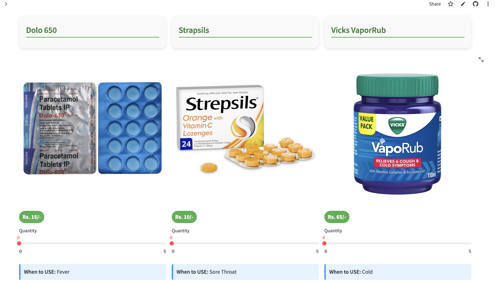

# 💊 PharmEasy - Pharmacy Management System

**PharmEasy** simplifies pharmacy operations through an intuitive web-based interface. Built with Python, Streamlit, and SQLite, it allows customers to place orders and admins to manage inventory, track sales, and handle user data with ease.

---

## 🛠️ Tech Stack

- **Python 3.7+** – Core logic and backend processing  
- **Streamlit** – Web interface for interactive UI  
- **SQLite** – Lightweight relational database  
- **Pillow** – Image handling for medication visuals  
- **pdfkit** – Generates order reports in PDF format

---

## ✨ Key Features

### 👥 Customer Portal
- Register and log in securely
- Browse medications with images and usage info
- Add to cart and place orders
- View past orders and download PDFs

### 🛒 Admin Dashboard
- Add, update, or delete medications
- Monitor stock and expiry
- Manage customer data
- Track and fulfill orders

---

## 🧱 System Architecture

- **Database**:  
  Tables for Customers, Medications, and Orders

- **Backend**:  
  Handles business logic, CRUD operations, and PDF generation

- **Frontend (Streamlit)**:  
  Responsive interface for both users and admins

---

## 🧩 Use Case

**Why PharmEasy?**  
Small to medium pharmacies often struggle with:
- Manual inventory tracking  
- Paper-based customer management  
- Inconsistent sales reporting  

---

## 🚀 Getting Started

### ✅ Requirements
- Python 3.7+
- `pip` package manager
- `wkhtmltopdf` for PDF export

### ⚙️ Setup Instructions

```bash
# 1. Clone the repo
git clone https://github.com/Vinay-Basargekar/PharmEasy.git
cd pharmeasy

# 2. Install dependencies
pip install -r requirements.txt

# 3. Install wkhtmltopdf
# macOS
brew install wkhtmltopdf

# Ubuntu/Debian
sudo apt-get install wkhtmltopdf

# Windows
# Download from https://wkhtmltopdf.org/downloads.html

#4. Ensure you have the required image files in the `/images` directory:
   - dolo650.jpg
   - strepsils.JPG
   - vicks.JPG

### Running the Application

1. Start the Streamlit server:
```bash
streamlit run app.py
```

2. Open your browser and navigate to:
```
http://localhost:8501
```

### Default Credentials

- **Admin Access**:
  - Username: `admin`
  - Password: `admin`

## 📊 Database Schema

The application uses a SQLite database with the following tables:

- **Customers**: Stores user information and credentials
- **Drugs**: Maintains medication inventory with details like name, expiry date, usage, quantity
- **Orders**: Tracks customer purchases with order items, quantities, and unique order IDs

## 📱 User Interface

### Home Page


### Product Catalog



### Admin Dashboard


### Database Schema

